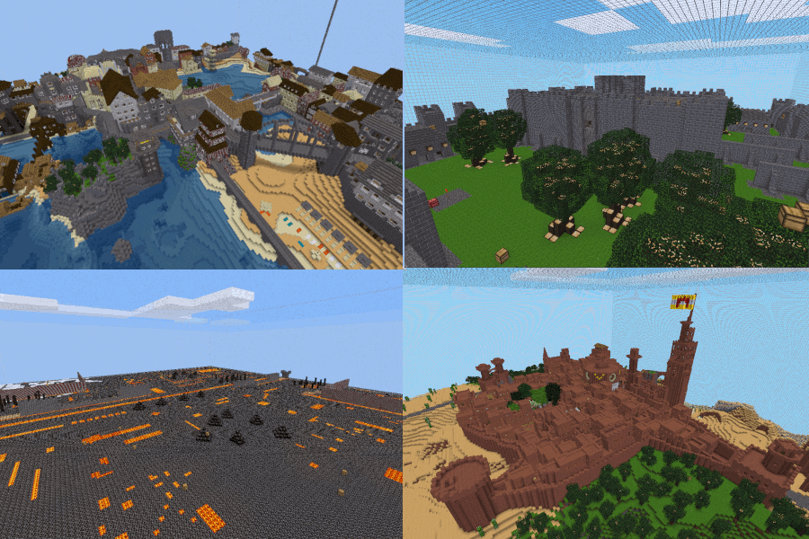

# CTF Extra Maps

## Summary

This mod adds a large number of extra maps to the Capture The Flag game. This mod is rather hacky and will likely not work with some future version of the CTF game. It's more for LAN parties than public CTF servers. This mod includes a number of nice maps that were rejected or removed from the CTF game. Some examples are the two karsthafen maps and hunting_season. This mod includes all CTF maps that were once in the CTF game but are now removed or disabled.

## Disabling maps

This mod has a Minetest setting `ctf_extra_maps_disabled_maps`. This can be set to a comma separated list of map names to disable. Disabled maps will never be automatically queued for new games. Disabled maps can still be manually selected. The `/disable_maps` command can also be used to disable maps. The CTF game will crash if fewer than three maps are left enabled. By default maze and serpents_pass are disabled. These two maps aren't very good. They are only included because they were in the CTF game at one time.

## Fixing the CTF Game screenshots

This mod comes with a bonus feature: the `/fix_screenshots` command. The command makes the screenshots and skybox work for built in CTF maps. Before using it, make sure `ctf_extra_maps` is listed under trusted mods in Minetest settings. After running the command, restart the server for the changes to take effect.

## Contributing Maps

I am looking for more maps to add. If you know of a cool map that's not included, please open an issue. If you don't know how to use git, creating a pull request is not recommended.

## License

Mod by MrRar

Some code taken from [Capture The Flag Game](https://github.com/MT-CTF/capturetheflag)

Maps are by various authors and have various licenses.

Code license: [GNU LGPLv2.1+](https://www.gnu.org/licenses/old-licenses/lgpl-2.1.html)

Media license: [CC BY-SA 3.0 Unported](https://creativecommons.org/licenses/by-sa/3.0/)
